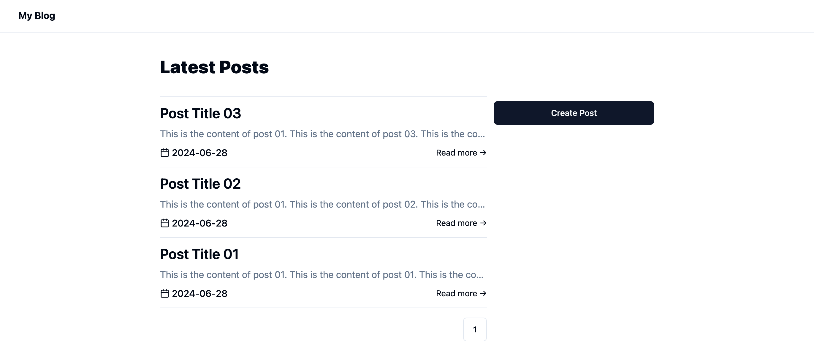

# T3-based simple blog

This is a [T3 Stack](https://create.t3.gg/) simple blog bootstrapped with `create-t3-app`.



## How to run

1. Install dependencies.
    ```
    npm install
    ```
2. Copy `./.env.example` to `./.env`
3. Run database migration.
    ```
    npm run db:push
    ```
4. Start the application.
    ```
    npm run dev
    ```

The application can be accessed at `http://localhost:3000`